# Pipeline de Pós-Classificação — Filtros Espaciais e Temporais
## MapBiomas Caatinga — Coleção 11

---

## Por que aplicar filtros?

A série temporal de 41 anos (1985–2025) do Landsat é construída a partir de mosaicos de cenas com diferentes qualidades radiométricas. Mesmo após o mascaramento de nuvens, a classificação GTB (Gradient Tree Boost) herda os seguintes ruídos das imagens brutas:

```
FONTE DO RUÍDO              MANIFESTAÇÃO NA CLASSIFICAÇÃO
──────────────────────────  ──────────────────────────────────────────────
Nuvens residuais            Pixels nulos (gaps) ou erro espectral pontual
Sombras de nuvens           Pixels classificados erroneamente como água/solo exposto
Sombras de relevo           Pixels sistematicamente mascarados em encostas
Aerossol / fumaça seca      Confusão entre classes espectralmente próximas
Scan-line gaps ETM+         Faixas de pixels sem dado (2003+)
Variação fenológica anual   "Blips" temporais em anos com seca/chuva atípicos
```

Os filtros removem esses artefatos em três domínios:

| Domínio | O que remove | Estratégia |
|---------|-------------|------------|
| **Temporal** | Erro de 1–5 anos isolados na série | Janela deslizante + consistência de vizinhos temporais |
| **Espacial** | Pixels isolados ("sal e pimenta") | contagem de pixels conectados + moda da vizinhança |
| **Frequência** | Oscilação em áreas permanentemente naturais | Frequência acumulada dos 40 anos |


sequencias de filtros 
filter Gap-fil >> Spatial_int >> Temporal Natural J3 >> Temporal Antrópico J3 >> Temporal Natural J4 >> 
Temporal Antrópico J4 >> Temporal Natural J5 >> Temporal Antrópico J5 >>  Frequency >> Spatial All  
---

## Estrutura de arquivos

```
src/filter/
├── arqParametros.py                        # parâmetros gerais (legado col9)
│
├── filtersGapFill_step1A.py                ★ STEP 1 — Preenchimento de gaps
│
├── filtersNaturalTemporal_step2A.py        ★ STEP 2A — Filtro temporal natural (série inversa)
├── filtersNaturalTemporal_step2A2025.py    ★ STEP 2A — Variante incluindo 2025
├── filtersNaturalTemporal_step2B.py        ★ STEP 2B — Filtro temporal natural (2ª passagem)
├── filtersNaturalTemporal_step2DB.py       ★ STEP 2DB — Filtro natural (deep-backward)
├── filtersAntropicTemporal_step2B.py       ★ STEP 2B — Filtro temporal antrópico
│
├── filtersSpatial_AllClass_step3A.py       ★ STEP 3A — Filtro espacial (todas as classes)
├── filtersSpatial_By_Cover_step3A.py       ★ STEP 3B — Filtro espacial (por cobertura)
│
├── filtersFrequency_step4A.py              ★ STEP 4 — Filtro de frequência temporal
├── filtersFrequency_step4mod.py            (referência col9 — não executado na col11)
│
└── filtersTemporal_step5A.py              ★ STEP 5 — Filtro temporal final
```

---

## Fluxograma de execução

```mermaid
flowchart TD
    A[/"Classificação bruta GTB\nBACIA_{n}_{year}\n41 anos × 49 bacias"/]
    A --> B

    subgraph S1["STEP 1 — Gap Fill"]
        B["filtersGapFill_step1A.py\n\nPreenchimento de pixels nulos\ncausados por nuvens, sombras\ne scan-lines do ETM+"]
    end

    B --> C

    subgraph S2["STEP 2 — Filtros Temporais"]
        direction TB
        C["step2A — NaturalTemporal\nJanela 6 anos · série 2025→1985\nReclassif: Natural=1 / Antrópico=0\nRegra: [Nat]...[Nat] → preenche meio"]
        C --> D["step2B — AntropicTemporal\nJanela 5 anos\nMesma lógica para classes antrópicas\n(21=Agropec., 22=Silvicult.)"]
        D --> E["step2B/DB — Natural (2ª passagem)\nJanela 3-4 anos\nCorreção fina de oscilações remanescentes"]
    end

    E --> F

    subgraph S3["STEP 3 — Filtros Espaciais"]
        direction TB
        F["step3A — Spatial All Classes\nconnectedPixelCount < 12\n→ moda da vizinhança 9×9"]
        F --> G["step3B — Spatial By Cover\nFiltro direcionado por par de classe\nSavana↔Uso · Uso↔Solo\nReducer: Mode ou Min por contexto"]
    end

    G --> H

    subgraph S4["STEP 4 — Filtro de Frequência"]
        H["step4A — Frequency Filter\nFrequência % de cada classe nos 40 anos\nPixels 100% naturais → classe dominante estável\nFloresta >70% · Savana ≥80% · Campestre >60%"]
    end

    H --> I

    subgraph S5["STEP 5 — Filtro Temporal Final"]
        I["step5A — Temporal Final\nJanelas 3/4/5 anos\nClasses: 3 (Floresta), 4 (Savana), 21 (Agropec.)\nRegra: [X] ... [≠X] ... [X] → [X] corrige o meio"]
    end

    I --> J[/"Mapa pós-filtrado final\nPOS-CLASS/TemporalCC\npronto para integração MapBiomas"/]

    style S1 fill:#d4e6f1,stroke:#2980b9
    style S2 fill:#d5f5e3,stroke:#27ae60
    style S3 fill:#fdebd0,stroke:#e67e22
    style S4 fill:#f9ebea,stroke:#e74c3c
    style S5 fill:#e8daef,stroke:#8e44ad
```



---

## Descrição detalhada de cada script

---

### STEP 1 — `filtersGapFill_step1A.py`
**Filtro de Preenchimento de Gaps**

**Problema resolvido:**
Após o mascaramento de nuvens e sombras, muitos pixels ficam sem classificação (nulos/mascarados). Em séries longas como 1985–2025, um pixel pode ter dado ausente em 5–15 anos, especialmente em regiões montanhosas da Caatinga onde sombras de relevo são sistemáticas.

**Como funciona:**

```
SÉRIE ORIGINAL:
Ano:  1985  1986  1987  1988  1989  1990  ...  2024  2025
Val:   --    --    4     4    --     3    ...   4     --
       ↑nulo      ↑ok        ↑nulo              ↑ok   ↑nulo

ESTRATÉGIA BACKWARD FILL (2025 → 1985):
1. Para 2025 sem valor → usa Col10 (2023) como referência
2. Para cada ano sem valor → usa o primeiro valor não-nulo dos anos FUTUROS
3. Para anos ≤ 1995 sem futuro disponível → fallback Col10

SÉRIE PREENCHIDA:
Ano:  1985  1986  1987  1988  1989  1990  ...  2024  2025
Val:   4     4     4     4     3     3    ...   4     4
```

**Regras de correção por classe:**
- Classe `33` (corpos d'água) só permanece se a Col10 também confirma `33` ou `3`
- Classe `19` (agropecuária) só permanece se Col10 confirma `19`, `21` ou `15`
- Classe `36` (lavoura irrigada) só permanece se Col10 confirma `36`, `21` ou `15`
- Pixels com valor `0` onde Col10 indica `33` → corrigidos para `33`

**Parâmetros principais:**
```python
input_asset  = '.../Classify_fromEEMV1joined'   # classificação bruta
output_asset = '.../POS-CLASS/Gap-fill'
year_col10_max = 2023   # último ano disponível na referência Col10
```

**Asset de saída:** `filterGF_BACIA_{nbacia}_GTB_V{version}_{nclasses}cc`

---

### STEP 2A — `filtersNaturalTemporal_step2A.py` / `step2A2025.py`
**Filtro Temporal para Classes Naturais (série inversa)**

**Problema resolvido:**
Após o gap fill, pixels em áreas naturais podem ter 1–3 anos com classificação antrópica devido a:
- Efeitos de secas extremas (redução da cobertura vegetal → confusão espectral)
- Nuvens/fumaça residuais que alteraram a reflectância sem serem mascaradas
- Variação fenológica interanual (mosaico de épocas diferentes)

**Como funciona (janela = 6 anos, direção 2025→1985):**

```
RECLASSIFICAÇÃO BINÁRIA:
Todas as classes → Natural (1) ou Antrópico (0)
  Classes 3,4,5,9,12,22,32,33 → 1 (Natural)
  Classes 15,19,21,25,26,29...→ 0 (Antrópico)

JANELA DESLIZANTE DE 6 ANOS:
Posição da janela centrada no ano C1 (2º da janela):

  [ C0 | →C1← | C2 | C3 | C4 | C5 ]
    ↑ref              ↑ref

  Se C0 == Natural (1)
  E  C5 == Natural (1)         ← bordas da janela confirmam Natural
  E  soma(C2,C3,C4) ≥ 1        ← pelo menos 1 ano interno é Natural
  → C1 é corrigido para Natural (valor real do ano C5)
```

**Por que direção inversa (2025→1985)?**
Preserva eventos reais de conversão (desmatamento confirmado por anos recentes é real). Ao iterar do futuro para o passado, classificações recentes servem de âncora.

**Asset de saída:** `filterTP_BACIA_{nbacia}_GTB_J6_V{version}` → `POS-CLASS/TemporalA`

---

### STEP 2B — `filtersAntropicTemporal_step2B.py`
**Filtro Temporal para Classes Antrópicas**

**Problema resolvido:**
Pixels em áreas de uso antrópico estável (pastagem, lavoura) podem apresentar 1–2 anos classificados como natural, gerando falsos eventos de "regeneração" na série.

**Diferença do step2A:**
- Mesma lógica de janela deslizante
- Mas a regra é aplicada para confirmar pixels ANTRÓPICOS (0) no centro da janela
- Janela de 5 anos: `[Antr. | → ano ← | Antr. | Antr. | Antr.]`
- Se os vizinhos temporais são antrópicos → o pixel central anômalo é corrigido

**Asset de saída:** `filterTP_BACIA_{nbacia}_GTB_J5_V{version}` → `POS-CLASS/Temporal`

---

### STEP 2B/DB — `filtersNaturalTemporal_step2B.py` / `step2DB.py`
**Filtro Temporal Natural — 2ª passagem**

Iteração adicional do filtro temporal natural com janelas menores (3–4 anos) aplicada sobre o resultado do step2A, capturando oscilações de curtíssimo período que escaparam da janela de 6 anos.

```
JANELA 3 ANOS (regra mais conservadora):
  [ C_ant | → C_atual ← | C_post ]
  Se C_ant = Natural E C_post = Natural → C_atual = Natural
```

---

### STEP 3A — `filtersSpatial_AllClass_step3A.py`
**Filtro Espacial — Todas as Classes**

**Problema resolvido:**
Mesmo após os filtros temporais, pixels isolados ("sal e pimenta") persistem. São gerados por:
- Bordas de nuvem não mascaradas (1–2 pixels de borda com erro espectral)
- Linhas de scan do ETM+ (Landsat 7, faixas horizontais)
- Variação sub-pixel de mistura espectral em bordas de classe

**Como funciona:**

```
PASSO 1 — Contar pixels conectados (8-vizinhança):
  Para cada pixel do ano Y:
    n_conn = connectedPixelCount(maxSize=12, eightConnected=True)

PASSO 2 — Identificar pixels isolados:
  maskConn = (n_conn < 12)   ← menos de 12 pixels conectados da mesma classe

PASSO 3 — Substituir por moda da vizinhança:
  kernel = ee.Kernel.square(4)   ← janela 9×9 pixels (≈270m × 270m)
  filtrado = imgClass.reduceNeighborhood(Reducer.mode(), kernel)

PASSO 4 — Aplicar apenas nos pixels isolados:
  resultado = imgBase.blend(filtrado.updateMask(maskConn))

VISUALIZAÇÃO:
  Antes:  . . . . A . . .    ← A isolado em meio a B
          . . . B B B . .
          . . . B A B . .    ← dois A isolados
          . . . B B B . .

  Depois: . . . . B . . .    ← corrigido para B (moda)
          . . . B B B . .
          . . . B B B . .    ← corrigido
          . . . B B B . .
```

**Parâmetros:** `min_connect_pixel = 12`, `kernel radius = 4px`

**Asset de saída:** `filterSP_BACIA_{nbacia}_GTB_V{version}` → `POS-CLASS/Spatials_all`

---

### STEP 3B — `filtersSpatial_By_Cover_step3A.py`
**Filtro Espacial por Cobertura**

Versão especializada do filtro espacial, aplicando redutores diferentes por par de classe:

| Par de classes           | Redutor | Resultado                                        |
|--------------------------|---------|--------------------------------------------------|
| Savana (4) + Uso (21)    | `mode`  | Classe majoritária da vizinhança                 |
| Uso (21) + Agropec. (22) | `min`   | Classe de menor valor (conservador, favorece 21) |

O `min` reducer é usado para não promover classe antrópica de alto valor onde o contexto é ambíguo.

**Asset de saída:** `filterSP_BACIA_{nbacia}_GTB_V{version}_{ncc}cc` → `POS-CLASS/Spatials_int`

---

### STEP 4A — `filtersFrequency_step4A.py`
**Filtro de Frequência Temporal**

**Problema resolvido:**
Pixels em áreas naturais permanentes (encostas, brejos, matas ciliares protegidas) podem oscilar entre natural e antrópico ao longo de 40 anos. Esta oscilação não representa mudança real, mas erros residuais de classificação.

**Como funciona:**

```
CÁLCULO DE FREQUÊNCIA (para cada pixel, ao longo dos 40 anos):
  freq_floresta  = count(class == 3) / 40 × 100 %
  freq_savana    = count(class == 4) / 40 × 100 %
  freq_campestre = count(class == 12) / 40 × 100 %
  freq_natural   = count(natural_class) / 40 × 100 %

CRITÉRIO DE ESTABILIDADE:
  Se freq_natural == 100%  (sempre natural nos 40 anos):
    → Pixel é "permanentemente natural"
    → Atribui classe dominante:
        Campestre (12) se freq_campestre > 60%
        Floresta  (3)  se freq_floresta  > 70%
        Savana    (4)  se freq_savana    ≥ 80%

EXEMPLO:
  Pixel com 38 anos = Savana (4) e 2 anos = Agropecuária (21):
    freq_natural = 38/40 × 100 = 95%  → NÃO satisfaz 100%
    → não é estabilizado por este filtro

  Pixel com 40 anos = Savana (4):
    freq_natural = 100%  E  freq_savana = 100% ≥ 80%
    → TODOS os 40 anos fixados como Savana (4)
```

**Por que thresholds assimétricos?**
- Floresta (3) é rara na Caatinga → exige confirmação alta (70%)
- Savana (4) é dominante → exige 80% para evitar generalização excessiva
- Campestre (12) tem sinal espectral instável → threshold mais baixo (60%)

**Asset de saída:** `filterFQ_BACIA_{nbacia}_GTB_V{version}` → `POS-CLASS/Frequency`
---

### STEP 5A — `filtersTemporal_step5A.py`
**Filtro Temporal Final**

**Problema resolvido:**
Após o filtro de frequência, podem restar inconsistências de 1 a 4 anos isolados onde uma classe aparece e desaparece sem justificativa ecológica. Por exemplo: uma área de pastagem que "vira floresta" por 2 anos e volta a ser pastagem.

**Como funciona (janelas de 3, 4 e 5 anos):**

```
JANELA 3 ANOS — Regra mais conservadora:
  Série:  ... [X] [≠X] [X] ...
              ↑ant  ↑erro ↑post
  Se ant == X  E  post == X  →  erro é corrigido para X

JANELA 5 ANOS — Para anomalias de 3 anos:
  Série:  ... [X] [≠X] [≠X] [≠X] [X] ...
  Se bordas == X  →  os 3 anos intermediários são corrigidos para X

ORDEM DE APLICAÇÃO (por prioridade ecológica):
  1. Classe 3  (Formação Florestal) — mais rara, protegida
  2. Classe 4  (Formação Savânica)  — dominante na Caatinga
  3. Classe 21 (Agropecuária)       — uso antrópico principal
```

**Construção da janela móvel:**
```python
# Exemplo para ano 1993 com janela=3:
lstyear = ['classification_1992', 'classification_1993', 'classification_1994']
#           ↑ ano anterior         ↑ ANO ALVO              ↑ ano posterior

# Borda esquerda (1985) usa regra especial — rearranjo de índices
# Borda direita (2025) usa regra especial
```

**Asset de saída:** `filterTP_BACIA_{nbacia}_GTB_J{janela}_V{version}` → `POS-CLASS/TemporalCC`

---

## Padrões das janelas deslizantes (filtros temporais)

O loop itera **invertido** (2025 → 1985). `C0` é sempre a âncora futura (já processada);
`C1`, `C2`, `C3`... são os anos centrais que podem ser corrigidos; o último elemento é a
âncora passada (referência).

### Janela = 3 (Natural e Antrópico)

```
Posição na série (ordem inversa):  C0   C1   C2
                                   ref  ALVO  ref

Regra:  se C0 == classe  E  C2 == classe  →  C1 é corrigido

NORMAL (anos intermediários):
  [ 1994 | →1993← | 1992 ]   → corrige 1993

BORDA FUTURA  (cc=0, ano=2025):
  Não é corrigido — serve apenas como âncora C0 para 2024.

BORDA PASSADA (ano=1985):
  Não pode ser C1 (não há ano anterior para fechar a janela).
  → adicionado sem modificação direto de imgClass.
```

### Janela = 4 (Natural e Antrópico)

```
Posição na série (ordem inversa):  C0    C1     C2    C3
                                   ref  ALVO1  ALVO2  ref

Regra:  se C0 == classe  E  C3 == classe
        E  C1 ≠ classe   E  C2 ≠ classe
        →  C1 e C2 são corrigidos (valor vem de C3)

NORMAL (anos intermediários):
  [ 2022 | →2021← | →2020← | 2019 ]

PENÚLTIMA JANELA  (regra_penultimo_stepJ4):
  [ 1988 | →1987← | →1986← | 1985 ]
  C3 = 1985 é a âncora mais antiga.

ÚLTIMA JANELA  (regra_ultimaJ4):
  [ 1987 | →1986← | →1985← | 1988 ]  ← 1985 entra como C2, 1988 como C3.

BORDA FUTURA  (cc=0, ano=2025):
  Não é corrigido — adicionado diretamente como lstbandNames[-1].

⚠️  ARMADILHA: ao reconstruir maps_bacias_c no penúltimo cc ativo
    (cc == last_cc = len(years)-1-delta), é OBRIGATÓRIO incluir o tail
    `lstbandsInv[cc + delta :]` — caso contrário classification_1985
    desaparece de maps_bacias_c antes das duas últimas janelas serem
    processadas.  Fix: adicionar a mesma linha do branch cc < last_cc.
```

### Janela = 5 (Natural)

```
Posição na série (ordem inversa):  C0    C1     C2     C3    C4
                                   ref  ALVO1  ALVO2  ALVO3  ref

Regra:  se C0 == classe  E  C4 == classe
        E  C1,C2,C3 ≠ classe
        →  C1, C2 e C3 são corrigidos (valor vem de C4)

NORMAL (anos intermediários):
  [ 2022 | →2021← | →2020← | →2019← | 2018 ]

BORDA PASSADA (ano=1985):
  1985 só pode ser C4 (âncora passada), nunca C1/C2/C3.
  → Não é processado pelo loop (cc ≥ 38 cai no else).
  → adicionado sem modificação:  imgOutput.addBands(imgClass.select('classification_1985'))
  (mesmo padrão do step2B — linha explícita após o loop)

BORDA FUTURA  (cc=0, ano=2025):
  Não é corrigido — adicionado diretamente como lstbandNames[-1].
```

### Janela = 6 (Natural — 1ª passagem step2A)

```
Posição na série (ordem inversa):  C0    C1     C2     C3     C4    C5
                                   ref  ALVO1  ALVO2  ALVO3  ALVO4  ref

Regra:  se C0 == 1  E  C5 == 1  →  C1..C4 corrigidos

BORDA FUTURA  (cc=0, ano=2025):
  Não é corrigido — adicionado diretamente.

BORDA PASSADA (anos 1985..1988):
  anos < anos[-janela+1] → regra_ultimaJ6 reutiliza os últimos 6 da lista.
```

### Resumo: quais anos ficam sem modificação por janela

| Janela | Anos que nunca são C_alvo | Tratamento |
|--------|--------------------------|------------|
| 3      | 2025, 1985               | adicionados direto de `imgClass` |
| 4      | 2025                     | adicionado direto; 1985 entra como C3 na última janela |
| 5      | 2025, 1985               | adicionados direto (2025 no cc=0, 1985 após o loop) |
| 6      | 2025                     | adicionado direto; 1985–1988 usam `regra_ultimaJ6` |

---

## Diagrama de ativos GEE por etapa

```
Classify_fromEEMV1joined         ← saída da classificação GTB
         │
         ▼  filtersGapFill_step1A.py
    POS-CLASS/Gap-fill
         │
         ▼  filtersNaturalTemporal_step2A.py
    POS-CLASS/TemporalA             (filtro natural 1ª passagem)
         │
         ▼  filtersAntropicTemporal_step2B.py
    POS-CLASS/Temporal              (filtro antrópico)
         │
         ▼  filtersNaturalTemporal_step2B.py  (opcional: 2ª passagem)
    POS-CLASS/Temporal              (refinamento)
         │
         ▼  filtersSpatial_AllClass_step3A.py
    POS-CLASS/Spatials_all          (filtro espacial geral)
         │
         ▼  filtersSpatial_By_Cover_step3A.py
    POS-CLASS/Spatials_int          (filtro espacial por cobertura)
         │
         ▼  filtersFrequency_step4A.py
    POS-CLASS/Frequency             (estabilização de áreas permanentes)
         │
         ▼  filtersTemporal_step5A.py
    POS-CLASS/TemporalCC            ← PRODUTO FINAL filtrado
```

---

## Resumo visual dos problemas e soluções

```
PROBLEMA           EXEMPLO VISUAL (série temporal, 1 pixel)     FILTRO APLICADO
─────────────────  ──────────────────────────────────────────   ───────────────
Gap (pixel nulo)   4  4  --  --  4  4  3  3  3  ...            Step 1 (Gap Fill)
                              ↑↑ gap

Blip natural       4  4  21  4  4  4  4  4  ...                Step 2A (NaturalTemporal)
                          ↑ erro 1 ano

Blip antrópico     21 21  4  21 21 21 21  ...                  Step 2B (AntropicTemporal)
                          ↑ erro 1 ano

Sal-e-pimenta      vizinhos = B B B B        pixel = A          Step 3A (Spatial)
(espacial)         → isolado, substituído por moda(B)

Oscilação          4  4  21  4  21  4  4  4  4  ...            Step 4 (Frequency)
permanente         → freq_natural = 87.5% → NÃO estabilizado
(área natural)     4  4   4  4   4  4  4  4  4  ...
                   → freq_natural = 100%  → ESTABILIZADO

Anomalia 2 anos    3  3  21 21  3  3  3  ...                   Step 5 (Temporal Final)
residual               ↑↑ 2 anos errôneos
```

---

## Execução (todos os scripts)

Todos os scripts seguem o mesmo padrão CLI:

```bash
# Executar para todas as 49 bacias:
cd src/filter/
python filtersGapFill_step1A.py

# O gerenciador interno distribui tasks entre contas GEE automaticamente
# Monitorar com:
cat relatorioTaskXContas.txt
```

O gerenciador de contas (`gerenciador()`) alterna entre as 7 contas GEE a cada N bacias processadas, respeitando o limite de tasks simultâneas por conta (`numeroTask = 6`).

---

*Produzido por Geodatin — Dados e Geoinformação | MapBiomas Caatinga Coleção 11*
